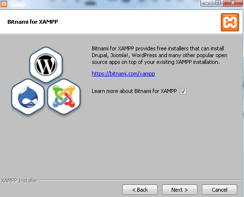
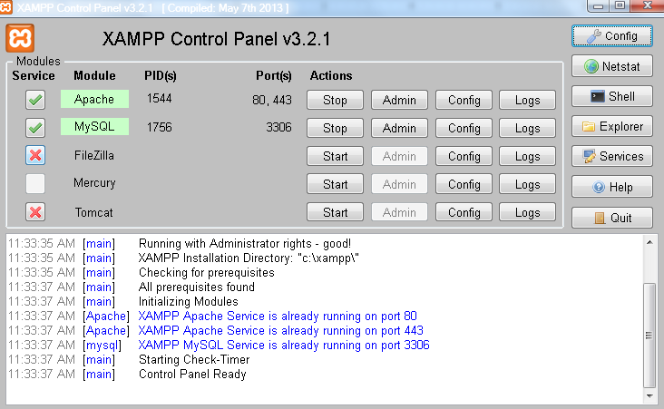
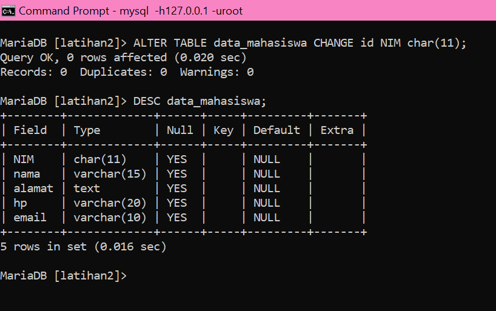
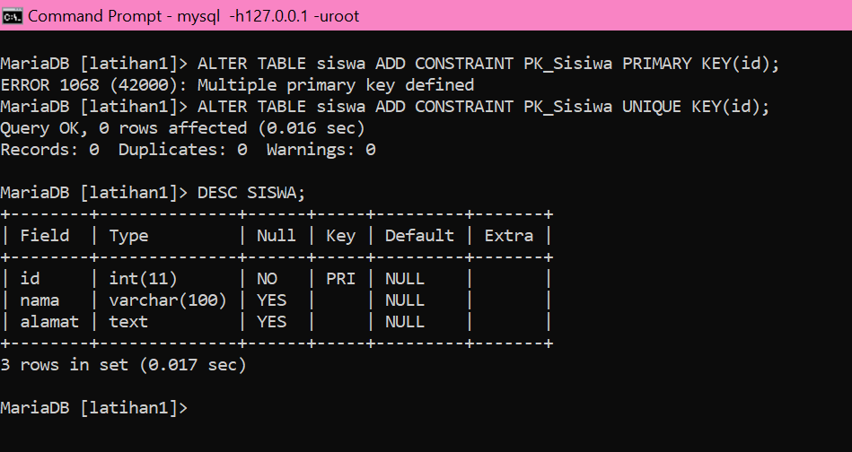

# Tugas minggu ke-4 
| NAMA   | Taufik Hidayat |
| --- | --- |
| NIM    | 312310576 |
| KELAS  | TI.23.A6 |
| DOSEN  | Agung Nugroho,S.Kom.,M.Kom |
| MATKUL | Basis Data                 |

## Latihan 2
•	Setiap mahasiswa mengambil mata kuliah dengan Kode Mata Kuliah, Nama Mata Kuliah dan SKS.
•	Setiap mata kuliah diajar oleh Dosen yang memiliki Kode Dosen, Nama Dosen.
•	Setiap Mahasiswa juga memiliki dosen wali untuk membantu konseling dalam perkuliahan selain mengajar mahasiswa.

## Latihan 3
Sebuah toko buku ingin membuat sistem yang dapat menampilkan katalog buku yang dapat menampilkan data buku (edisi terbitan), penulis, penerbit.
•	Setiap buku terdiri dari satu atau lebih penulis,
•	Setiap penulis dapat menulis satu atau lebih judul buku,
•	Setiap buku diterbitkan oleh satu penerbit.
•	Setiap buku memiliki edisi terbitan (judul yang sama bisa diterbitkan dalam beberapa edisi)

## Latihan 4
Contoh : sistem informasi tiketing online dalam Sebuah Perusahaan Kapal. Setiap kapal memiliki
 jenis dan kapasitas yang berbe ma, kelas, kode kapal, harga dan kapasitas. Pada setiap kapal terdiri beberapa kelas dengan fasilitas dan harga yang berbeda pula

# Tugas Minggu ke-5
## Structure Query Language (SQL)
Tugas Praktikum
1. Buat sebuah database dengan nama latihan2!
2. Buat sebuah tabel dengan nama biodata (nama, alamat) didalam database latihan1!
3. Tambahkan sebuah kolom keterangan (varchar 15), sebagai kolom terakhir!
4. Tambahkan kolom id (int 11) di awal (sebagai kolom pertama)!
5. Sisipkan sebuah kolom dengan nama phone (varchar 15) setelah kolom alamat!
6. Ubah tipe data kolom id menjadi char(11)!
7. Ubah nama kolom phone menjadi hp (varchar 20)!
8. Tambahkan kolom email setelah kolom hp
9. Hapus kolom keterangan dari tabel!
10. Ganti nama tabel menjadi data_mahasiswa!
11. Ganti nama field id menjadi nim!
12. Jadikan nim sebagai PRIMARY KEY!
13. Jadikan kolom email sebagai UNIQUE KEY

Sebelumnya, kita perlu menginstall aplikasi XAMMP terlebih dahulu, berikut langkah-langkahnya :

1. Download XAMPP
Download XAMPP terbaru melalui website Apache Friends berikut ini.

2. Instal XAMPP
1. Lakukan instalasi setelah Anda selesai mengunduh. Selama proses instalasi mungkin Anda akan melihat pesan yang menanyakan apakah Anda yakin akan menginstalnya. Silakan tekan Yes untuk melanjutkan instalasi.

2. Klik tombol Next.

3. Pada tampilan selanjutnya akan muncul pilihan mengenai komponen mana dari XAMPP yang ingin dan tidak ingin Anda instal. Beberapa pilihan seperti Apache dan PHP adalah bagian penting untuk menjalankan website dan akan otomatis diinstal. Silakan centang MySQL dan phpMyAdmin, untuk pilihan lainnya biarkan saja.

4. Berikutnya silakan pilih folder tujuan dimana XAMPP ingin Anda instal. Contohnya di direktori C:\xampp.

5. Pada halaman selanjutnya, akan ada pilihan apakah Anda ingin menginstal Bitnami untuk XAMPP, dimana nantinya dapat Anda gunakan untuk install WordPress, Drupal, dan Joomla secara otomatis.

6. Pada langkah ini proses instalasi XAMPP akan dimulai. Silakan klik tombol Next.

7. Setelah berhasil diinstal, akan muncul notifikasi untuk langsung menjalankan control panel. Silakan klik Finish.

8. Jalankan XAMPP
Silakan buka aplikasi XAMPP kemudian klik tombol Start pada Apache dan MySQL. Jika berhasil dijalankan, Apache dan MySQL akan berwarna hijau seperti gambar di bawah ini.

### Mengakses MySQL dengan Command Prompt (CMD)
Bagi anda yang menggunakan apache/xampp di Windows. Dalam mengelola database bisa melalui Command Prompt (CMD) di Windows.
Caranya seperti berikut :
* Buka CMD klik Start => All Programs =>Accessories => Pilih Command Prompt atau dengan menekan tombol windows + R di keyboard setelah itu tuliskan cmd dan enter.
* Saat pertama masuk Command Prompt posisi Anda di C:\Users\namauser>

* Tuliskan cd dilanjutkan dengan direktori dimana Anda menginstall xammp, contohnya Anda install di D maka, cd d:\

* Tuliskan cd xampp/mysql/bin
Anda akan masuk ke c:\xampp\mysql\bin>

Secara default tuliskan #mysql-h.127.0.0.1 -u root -p dan enter, jika mysql Anda menggunakan password anda bisa menggunakan perintah berikut : mysql.exe mysql -u -namauser -p dan enter kemudian masukkan password Anda.

* membuat DATABASE
untuk membuat database gunakan perintah berikut ini:

`CREATE DATABASE [nama_database]`

nah karena tugasnya membuat database dengan nama latihan2 maka saya akan menggunakan latihan2 sebagai nama database saya.

* untuk masuk ke dalam database kita menggunakan perintah USE

`USE latihan2`

* membuat tabel
Sebelum membuat Tabel, pastikan database aktif yang digunakan dengan terlebih dahulu masuk kedalam databasenya, dengan perintah USE.
dalam membuat tabel menggunakan perintah berikut :

`CREATE TABLE nama_tabel (nama_field1 tipe _data(ukuran), nama_field2 tipe_data(ukuran), ..., nama_fieldn tipe_data(ukuran));`

Berikut perintah yang saya gunakan :

`CREATE TABLE biodata (nama VACHAR (15), alamat TEXT);`

* Untuk menampilkan struktur tabel yang sudah dibuat, gunakan perintah:

`DESCRIBE [nama_tabel];`

atau

`DESC [nama_tabel]`

* Untuk menambahkan field, gunakan perintah:

`ALTER TABLE [nama_tabel] ADD COLUMN nama_field tipe_data(ukuran) [AFTER|BEFORE|FIRST]`

nah perintah praktikum yaitu menambahkan sebuah kolom keterangan (varchar 15), sebagai kolom terakhir.

maka saya menggunakan : 

`ALTER TABLE biodata ADD COLUMN keterangan VARCHAR (15) AFTER alamat;`

* menambahkan kolom id (int 11) di awal (sebagai kolom pertama) dapat menggunakan perintah berikut:

`ALTER TABLE biodata ADD COLUMN id int (11) FIRST;`

* untuk menyisipkan sebuah kolom dengan nama phone (varchar 15) setelah kolom alamat dapat menggunakan perintah berikut:

`ALTER TABLE biodata ADD COLUMN phone VARCHAR (15) AFTER alamat;`

* Untuk mengubah tipe data menggunakan perintah berikut

`ALTER TABLE [nama_tabel] MODIFY nama_field tipe_data_baru(ukuran);`

di sini saya akan mengubah tipe data kolom id menjadi char(11):

`ALTER TABLE biodata MODIFY id char(11);`

* untuk mengubah nama kolom phone menjadi hp (varchar 20) dapat menggunakan perintah berikut :

`ALTER TABLE [nama_tabel] CHANGE nama_field_lama nama_field_baru tipe_data(ukuran);`

`ALTER TABLE biodata CHANGE phone hp varchar(20);`

* Untuk menabahkan kolom email setelah kolom hp bisa menggunakan perintah berikut :

`ALTER TABLE biodata ADD COLUMN email VARCHAR (10) AFTER hp;`

* Untuk menghapus field, gunakan perintah:

`ALTER TABLE [nama_tabel] DROP nama_field;`

di sini saya akan menghapus kolom keterangan dari tabel,

`ALTER TABLE biodata DROP keterangan;`

* Untuk mengubah nama tabel, gunakan perintah:

`ALTER TABLE [nama_tabel] RENAME [nama_tabel_baru]`

di sini saya akan mengganti nama tabel menjadi data_mahasiswa,

`ALTER TABLE biodata RENAME data_mahasiswa;`

* selanjutnya saya akan mengganti nama field id menjadi nim,

`ALTER TABLE data_mahasiswa CHANGE id NIM char(11);`

* Untuk menambah Index, gunakan perintah:

`ALTER TABLE [nama_tabel] ADD [INDEX|PRIMARY KEY] (nama_field);`

• Atau bisa juga menggunakan perintah :

`CREATE INDEX nama_index ON nama_tabel (nama_field);`

di sini saya akan menjadikan nim sebagai PRIMARY KEY,

`ALTER TABLE data_mahasiswa ADD PRIMARY KEY (NIM);`

* menjadikan email sebagai unique key dapat menggunakan perintah berikut:

`ALTER TABLE data_mahasiswa ADD UNIQUE KEY (email);`

## Evaluasi dan Pertanyaan

* Tulis semua perintah-perintah SQL percobaan di atas beserta outputnya! 

### SQL DDL

1. Membuat Database

`CREATE DATABASE latihan1;`

2. Membuat TABLE

`CREATE TABLE siswa (nama VARCHAR(100), alamat TEXT);`

3. Menambah Kolom

`ALTER TABLE siswa ADD COLUMN ketengan TEXT AFTER alamat;`

4. Menambah kolom diawal

`ALTER TABLE siswa ADD COLUMN id INT FIRST;`

5. Mengubah nama kolom

`ALTER TABLE siswa CHANGE COLUMN keterangan kelas TEXT;`

6. Mengubah tipe data

`ALTER TABLE siswa MODIFY COLUMN kelas VARCHAR(10);`

7. Menghapus kolom

`ALTER TABLE siswa DROP COLUMN kelas;`

8. menambah PRIMARY KEY

`ALTER TABLE siswa ADD PRIMARY KEY(id);`

9. Menambah CONSTRAINT

`ALTER TABLE siswa ADD CONSTRAINT uk_sisiwa PRIMARY KEY(id);`

karena primary key telah digunakan dalam id maka kita bisa menggunakan uniqe key sebagai gantinya agar menghindari multiple primary key.

10. Menghapus PRIMARY KEY

`ALTER TABLE siswa DROP PRIMARY KEY;`

11. Menghapus CONSTRAINT

`ALTER TABLE siswa DROP CONSTRAINT pk_siswa;`

* Apa maksud dari int (11)?

jawab :

Yang dimaksud int(11) artinya suatu data yang dipakai atau digunakan menggunakan tipe data int atau integer dengan length atau panjang karakter 11.

* Ketika kita melihat struktur tabel dengan perintah desc, ada kolom Null yang berisi Yes dan No. Apa maksudnya ?

jawab: 

Null di Mysql adalah istilah atau tipe data khusus dalam pemograman yang menyatakan ‘tidak ada nilai’, NULL tidak sama dengan 0, atau ‘’(string kosong). 

No = Not Null, Fungsinya untuk memastikan bahwa nilai pada kolom tersebut tidak boleh kosong. Jika kita menginput data, namun tidak memberikan nilai untuk kolom tersebut, akan menghasilkan error pada MySQL.

Yes = Null , Atribut NULL berkebalikan dengan NOT NULL, dimana jika sebuah kolom didefinisikan dengan NULL, maka kolom tersebut tidak harus berisi nilai.

* Buat laporan praktikum beserta langkah-langkah yang dilakukan dalam bentuk tutorial beserta screenshot outputnya (point 1)
